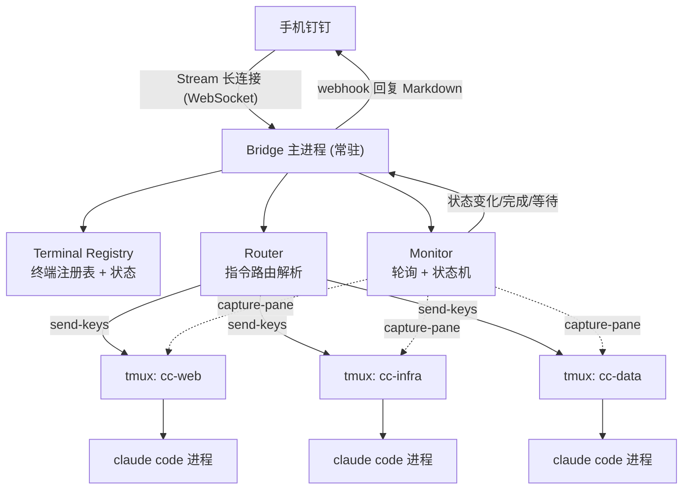

# Hivemind

<aside>
🧠

**Hivemind（蜂群心智）** —— 用 tmux 把多个 Claude Code 终端变成常驻「脑区」，通过手机钉钉远程下发指令、定向指挥某个终端、并实时监控每个终端的工作状态。本机零入站端口，全程出站长连接，可 7×24 运行。

</aside>

## 项目描述

Hivemind 是一个**面向 Claude Code 的远程多终端指挥与监控系统**。它把每个 Claude Code 会话封装成一个独立、持久化的「脑区」（tmux session），并在它们之上架设一个常驻 Bridge 进程，负责把手机钉钉里的自然语言指令路由到指定终端、安全地注入交互界面，同时持续抓取每个终端的输出与状态，在「任务完成 / 等待确认 / 出错」时主动推送回钉钉。

一句话：**让你在手机上像切换窗口一样，远程指挥一群常驻的 Claude Code 终端干活，并随时掌握它们的状态。**

### 解决什么问题

- **离开电脑也能干活**：人在通勤、开会、外出时，依旧能下发指令、纠偏长任务、批准危险命令。
- **多任务并行**：多个项目 / 多个终端同时跑，互相隔离，可独立 spawn / kill / restart。
- **状态可观测**：不再「发完指令石沉大海」，完成、等待、报错都会主动通知。
- **零暴露面**：本机不开放任何入站端口，钉钉与 Claude 均为出站长连接，不暴露公网。

### 适合谁

- 重度使用 Claude Code、需要长时间挂机跑任务的开发者；
- 希望「手机当遥控器」远程驱动本地/服务器终端的人；
- 想把一台 MacBook / 服务器变成 7×24 常驻 AI 工作站的人。

---

## ✨ 核心特性

- 🧩 **多脑区隔离**：每个 Claude 终端 = 一个独立 tmux session，可寻址、可独立生命周期管理。
- 📱 **手机远程指挥**：钉钉 Stream 长连接，`@终端名` 定向、`@all` 广播、会话粘性切换默认终端。
- 🔁 **安全指令注入**：literal 模式 send-keys，规避特殊字符与多行 prompt 的执行竞态。
- 👀 **实时监控**：抓屏 diff + 状态机判断（idle / busy / waiting / error / dead），增量推送不刷屏。
- 🪝 **混合监控策略**：Claude Code hooks 管「事件」（最准）+ capture-pane 管「内容」（最全）。
- 🔒 **零入站端口**：全程出站长连接，发送者白名单 + 权限闸双重防护。
- ⏱️ **7×24 常驻**：tmux 保活 + pmset/caffeinate 防睡眠 + systemd/launchd 托管自愈。

---

## 🏗️ 架构总览

核心思路：**tmux = 持久化躯干，钉钉 = 手机遥控器，Bridge = 中间路由与监控**。



四个子系统：**Registry（注册表）· Router（路由）· Forwarder（转发）· Monitor（监控）**。

---

## 🚀 快速开始

### 1. 环境要求

- macOS / Linux，已安装 `tmux`、`python3`
- 已安装并登录 `claude`（Claude Code CLI）
- 一个钉钉「企业内部应用 → 机器人」，接收方式选 **Stream 模式**

### 2. 安装

```bash
git clone <your-repo-url> hivemind
cd hivemind
pip3 install -r requirements.txt   # dingtalk-stream 等依赖
```

### 3. 配置

创建 `.env`（或 `config.yaml`）：

```bash
DINGTALK_CLIENT_ID=your_app_key
DINGTALK_CLIENT_SECRET=your_app_secret
ALLOWLIST=your_staff_id          # 发送者白名单，逗号分隔
MONITOR_INTERVAL=2               # 监控轮询间隔（秒）
```

### 4. 启动

```bash
# 临时前台运行
caffeinate -i -s python3 bridge.py

# 或交给 systemd / launchd 托管，崩溃自动拉起
```

### 5. 在钉钉里使用

```
/spawn web ~/projects/frontend   # 新建一个名为 web 的终端
@web 重构登录模块                  # 指挥 web 终端，并把默认终端切到 web
重构完顺便补一下单测               # 无前缀 → 继续发给当前默认终端
/status                          # 查看所有终端状态看板
```

---

## ⌨️ 指令语法

| 语法 | 含义 |
| --- | --- |
| `@web 重构登录模块` | 发给 web 终端，并把默认终端切到 web |
| `@all 拉一下最新代码` | 广播给所有终端 |
| `/spawn web ~/projects/frontend` | 新建终端 |
| `/kill web` | 关闭终端 |
| `/ls` 或 `/status` | 列出所有终端及状态看板 |
| `/log web` | 拉取该终端最近输出 |
| `/y web` / `/n web` | 给卡在确认框的终端回 y/n |
| 无前缀纯文本 | 发给「当前默认终端」（会话粘性） |

---

## 👀 监控与状态

Monitor 采用**混合策略**：

- **事件层（最准）**：接入 Claude Code 的 `Stop` / `Notification` / `PostToolUse` hooks，在「完成 / 需授权 / 工具调用」时回调 Bridge。
- **内容层（最全）**：`capture-pane` 抓屏 + diff 提取增量输出，`pipe-pane` 落盘日志做兜底。

状态机：

| 状态 | 含义 | 触发动作 |
| --- | --- | --- |
| 🟢 idle | 等待输入（已处理完） | 从 busy → idle 时推送「任务完成」 |
| 🔵 busy | 正在思考 / 执行 | 排队后续指令，避免竞态 |
| 🟡 waiting | 卡在确认框（危险命令授权） | 推送提醒，等 `/y` 或 `/n` |
| 🔴 error | 出错 | 推送错误尾部日志 |
| ⚫ dead | session 不存在 | 通知并可选自动重建 |

---

## ⏱️ 7×24 常驻部署（macOS）

<aside>
🧩

**关键认知**：锁屏 ≠ 睡眠。真正杀死后台的是系统睡眠 (sleep) 和网络休眠。目标 = 锁屏 + 阻止睡眠 + 保持网络。

</aside>

```bash
# 永久级：接电源时永不睡眠、合盖也不睡、黑屏省电、保连接、可唤醒
sudo pmset -c sleep 0 disablesleep 1 disksleep 0 displaysleep 10 \
           tcpkeepalive 1 womp 1 powernap 1

# 关自动更新，避免夜里强制重启
sudo softwareupdate --schedule off
```

- **优先有线网**，长时间无人值守比 Wi-Fi 稳；
- Bridge 用 **systemd / launchd** 托管，崩溃自动拉起；
- 注意 **FileVault + 重启** 会卡在解锁界面，可用 `sudo fdesetup authrestart` 做一次性免密重启。

---

## 🔒 安全清单

- **发送者白名单**：钉钉端只认指定 staffId，杜绝他人下指令。
- **权限闸**：每个终端配 `--permission-mode`，危险命令二次确认，避免手机误触 `rm -rf`。
- **状态判定兜底**：抓屏依赖 UI 字符串，Claude 升级可能失效 → 用 hooks 事件兜底。
- **send-keys 竞态**：每终端消息队列串行化。
- **零入站端口**：钉钉 Stream 与 Claude 均出站长连接，不暴露公网。

---

## 🗺️ Roadmap

- [ ]  **M1 MVP**：TerminalManager + Registry + `@name` 路由 + send-keys 转发 + `/ls` `/status`
- [ ]  **M2 监控**：Monitor 抓屏 diff + 基础状态机 + 状态变化推钉钉
- [ ]  **M3 精确事件**：接 Claude hooks（完成/等待/出错）+ pipe-pane 日志
- [ ]  **M4 健壮性**：消息队列 + 发送者白名单 + 权限闸 + 自愈重建
- [ ]  **M5 上线**：systemd/launchd 托管 + pmset 常驻配置 + 验证清单全过

---

<aside>
🧭

**两个最关键工程决策**：① 每终端独立 tmux session（隔离 + 可寻址）；② hooks + 抓屏的混合监控（事件准 + 内容全）。

</aside>
