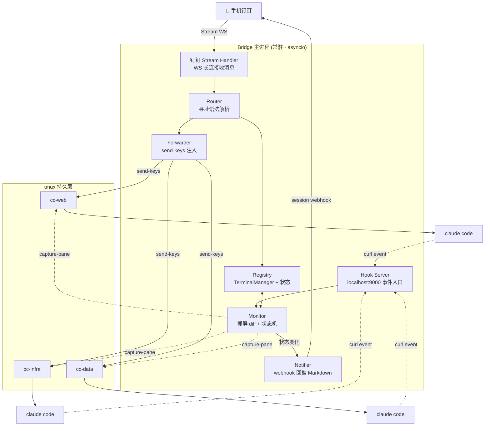

# Hivemind 构建蓝图与执行计划

> **一句话定义**:Hivemind = 用 tmux 把多个 Claude Code 终端变成常驻"脑区",通过钉钉手机端远程下发指令、定向指挥、实时监控。本机零入站端口,全程出站长连接,可 7×24 运行。

---

## 一、架构梳理

### 1.1 核心心智模型

| 角色 | 实体 | 职责 |
|------|------|------|
| **躯干(持久化)** | tmux session | 进程容器,断网/断 SSH 不死,保留完整上下文 |
| **遥控器** | 手机钉钉 | 下发指令、接收状态推送 |
| **大脑中枢** | Bridge 主进程 | 路由、转发、监控、状态汇报 |
| **脑区** | 每个 `cc-<name>` session | 一个独立 Claude Code 交互实例 |

### 1.2 模块分解(4+1 子系统)



### 1.3 五个子系统职责

1. **Registry(注册表)** — `TerminalManager` + `Terminal` dataclass。管理 `cc-<name>` session 的生命周期(spawn/kill/list_alive)与状态(IDLE/BUSY/WAITING/ERROR/DEAD)。
2. **Router(路由)** — 解析钉钉文本寻址语法(`@web`/`@all`/`/spawn`/`/kill`/`/ls`/`/log`/`/y`/`/n`/纯文本粘性),输出结构化 action。
3. **Forwarder(转发)** — 安全把 prompt 注入 Claude:`Esc 清残留 → -l literal 发文本 → 单独发 Enter`。
4. **Monitor(监控)** — 系统最难部分。双轨:① `capture-pane` 抓屏 diff 判状态+提增量;② Claude hooks 事件兜底(最准)。
5. **Notifier(汇报)** — 状态变化时通过钉钉 session webhook 推送 Markdown(完成✅/等待⚠️/出错❌/看板)。

### 1.4 技术栈与依赖

| 维度 | 选型 |
|------|------|
| 语言/运行时 | Python 3.10+,asyncio 单进程并发 |
| 终端持久化 | tmux ≥ 3.0 |
| 钉钉接入 | `dingtalk-stream` 官方 SDK(Stream 模式,WS 长连接) |
| Hook 事件 | Claude Code hooks(Stop/Notification/PostToolUse)→ curl localhost:9000 |
| 进程保活 | macOS launchd / Linux systemd + `caffeinate`/`pmset` |
| 安全 | 发送者 staffId 白名单 + `--permission-mode` 权限闸 |

---

## 二、建议项目目录结构

```
hivemind/
├── pyproject.toml            # 依赖与打包
├── README.md
├── config/
│   ├── config.example.toml   # AppKey/Secret/白名单/轮询间隔
│   └── claude-hooks.json     # 注入到 ~/.claude/settings 的 hook 片段
├── hivemind/
│   ├── __init__.py
│   ├── main.py               # 入口:启动 monitor_loop + dingtalk stream + hook server
│   ├── registry.py           # Terminal / TermState / TerminalManager
│   ├── router.py             # Router.parse()
│   ├── forwarder.py          # forward() send-keys
│   ├── monitor.py            # poll_terminal / detect_state / strip_ui_noise
│   ├── notifier.py           # push_dingtalk / render_status
│   ├── hooks_server.py       # aiohttp /event 接收 Claude hook 回调
│   ├── dingtalk.py           # ClaudeHandler(ChatbotHandler) + dispatch()
│   └── config.py             # 配置加载
├── scripts/
│   ├── com.hivemind.bridge.plist   # launchd (macOS)
│   └── hivemind.service            # systemd (Linux)
├── tests/
│   ├── test_router.py
│   ├── test_detect_state.py
│   └── fixtures/             # 真实 capture-pane 抓屏样本
└── logs/                     # pipe-pane 落盘日志
```

---

## 三、分阶段执行计划(Roadmap)

> 原则:每个里程碑都能**独立跑通+验收**,不追求一步到位。先打通"发指令→进 Claude→看回复",再逐步加监控、健壮性、上线。

### M0 · 环境准备(0.5 天)
- [ ] 安装 tmux、Python 3.10+,创建 venv
- [ ] 钉钉开发者后台:建企业内部应用 → 机器人 → 接收方式选 **Stream 模式**,拿到 `ClientID(AppKey)` / `ClientSecret`
- [ ] 本机装好 `claude` CLI 并能登录跑通
- [ ] `pip install dingtalk-stream aiohttp tomli`
- **验收**:`tmux new -s test -d && tmux send-keys -t test 'claude' Enter`,手动能进 Claude 交互界面。

### M1 · MVP:能从钉钉指挥单/多终端(1.5 天)
构建顺序:`registry.py → router.py → forwarder.py → dingtalk.py → main.py`
- [ ] **Registry**:`TerminalManager.spawn/kill/list_alive`,`Terminal` dataclass + `TermState`
- [ ] **Router**:实现寻址语法解析(`@name`/`@all`/`/spawn`/`/kill`/`/ls`/`/log`/`/y`/`/n`/纯文本粘性)
- [ ] **Forwarder**:`Esc → send-keys -l prompt → Enter` 三步法
- [ ] **dispatch()**:把 action 派发到 spawn/kill/forward/status
- [ ] **钉钉 Handler**:收消息→parse→dispatch→`reply_markdown`(走 session webhook)
- **验收**:手机 `@web 你好` → web 终端 Claude 收到并回复;`/ls` 能列出终端;`/spawn`/`/kill` 生效。
- **关键坑**:Forwarder 必须用 `-l` literal 且文本与 Enter 分开发(否则 prompt 里的 `;$空格` 被当快捷键)。

### M2 · 监控:抓屏 diff + 状态机推送(1.5 天)
- [ ] **detect_state()**:基于 `capture-pane` tail 15 行做特征匹配 → IDLE/BUSY/WAITING/ERROR
- [ ] **strip_ui_noise()**:去 ANSI/边框/spinner/光标
- [ ] **poll_terminal()**:md5 去重 + `difflib.ndiff` 提增量
- [ ] **monitor_loop()**:`asyncio` 每 2s 轮询所有终端,状态变化触发 `on_state_change`
- [ ] **Notifier**:完成/等待/出错分别推不同 Markdown;`render_status` 状态看板
- **验收**:发个长任务,完成时手机收到 ✅ 推送;触发危险命令确认时收到 ⚠️ 且能 `/y web` 放行。
- **关键坑**:状态特征字符串**依赖 Claude Code 具体版本 UI**。必须先抓真实 `capture-pane` 输出存进 `tests/fixtures/` 校准 `detect_state`,并写单测。

### M3 · 精确事件:接 Claude hooks + pipe-pane 日志(1 天)
- [ ] **hooks_server.py**:aiohttp 起 `localhost:9000/event`,接收 `term=&type=` 回调
- [ ] **claude-hooks.json**:配置 `Stop`(done)/`Notification`(waiting)/`PostToolUse`,curl 回调 Monitor
- [ ] **pipe-pane 落盘**:`tmux pipe-pane -t cc-web -o 'cat >> logs/cc-web.log'`,tail 文件做增量
- [ ] **混合策略**:hooks 管"事件"(最准),抓屏管"内容"(全)
- **验收**:Claude 完成任务时通过 hook 立即推送(不依赖轮询延迟);日志文件持续落盘。

### M4 · 健壮性:队列 + 安全闸 + 自愈(1 天)
- [ ] **发送者白名单**:`msg.sender_staff_id not in ALLOWLIST` 直接拒绝
- [ ] **权限闸**:每终端配 `--permission-mode`,危险命令二次确认
- [ ] **每终端消息队列**:BUSY 时排队/提示"是否打断(Esc)",串行化避免 send-keys 竞态
- [ ] **自愈**:monitor 每轮校验 `tmux list-sessions`,终端消失 → 标 DEAD + 通知 + 可选自动重建
- **验收**:非白名单用户指令被拒;连发多条消息不串台;手动 kill 一个 session 后收到 ⚫ 通知。

### M5 · 上线:常驻托管 + 7×24(0.5 天)
- [ ] **进程托管**:macOS launchd plist / Linux systemd service,崩溃自动拉起
- [ ] **macOS 保活**:`pmset -c sleep 0 disablesleep 1 tcpkeepalive 1 womp 1 powernap 1`
- [ ] **合盖运行**:外接电源+外接显示器(官方最稳) 或 `disablesleep 1`(需实测)
- [ ] **隐藏杀手**:`softwareupdate --schedule off`;FileVault 用 `fdesetup authrestart`
- [ ] **网络**:优先有线网,bridge 加 30s keepalive 心跳
- **上线验证清单**:
  - [ ] 合盖/锁屏黑屏后手机能 ping 通
  - [ ] `pmset -g assertions` 显示 PreventSystemSleep 生效
  - [ ] 拔外接键鼠后任务仍在跑
  - [ ] 钉钉 `@web` 合盖状态下 Claude 仍响应
  - [ ] `/status` 正确显示多终端
  - [ ] 模拟断网 30s 后 Stream 与 Claude 自动恢复

---

## 四、关键技术难点与对策

| 难点 | 风险 | 对策 |
|------|------|------|
| 状态判定脆弱 | Claude 升级改 UI → 抓屏特征失效 | **hooks 事件兜底**(最准),抓屏只兜内容;特征串集中配置便于改 |
| send-keys 注入 | 特殊字符被当快捷键、多行被中途执行 | `-l` literal + 文本/Enter 分开发 + 先 Esc 清残留 |
| send-keys 竞态 | 并发消息互相打断 | 每终端独立消息队列串行化 |
| 输出清洗 | ANSI/边框/spinner 刷屏 | `pipe-pane + 正则` 比纯 diff 省心 |
| 误触危险命令 | 手机误发 `rm -rf` | `--permission-mode` + `/y /n` 确认闸 + 白名单 |
| Stream 只能收不能回 | 回复发不出去 | 必须用消息里的 **session webhook** 或 OpenAPI |

---

## 五、两个最关键工程决策(必须抓住)

1. **每终端独立 tmux session** — 隔离干净 + 可寻址(用 session 而非 window)。
2. **hooks + 抓屏的混合监控** — 事件准(hooks)+ 内容全(抓屏)。

> 抓住这两点,整套多终端远程指挥系统就能稳定落地。

---

## 六、建议总工期

| 里程碑 | 工期 | 累计 |
|--------|------|------|
| M0 环境 | 0.5d | 0.5d |
| M1 MVP | 1.5d | 2d |
| M2 监控 | 1.5d | 3.5d |
| M3 事件 | 1d | 4.5d |
| M4 健壮 | 1d | 5.5d |
| M5 上线 | 0.5d | **6d** |

**最小可用闭环 = M0+M1(2 天)** 即可手机指挥;M2 之后才有"实时监控"体感。
